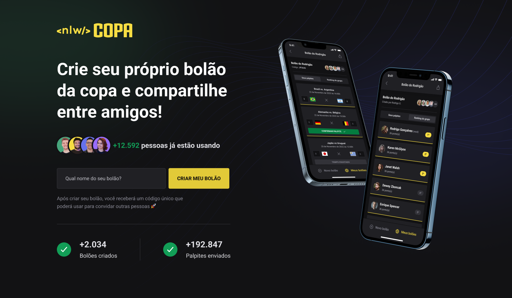

# NLW project

<p align="center">
  <a href="#-projeto">Project</a> &nbsp;&nbsp;&nbsp;|&nbsp;&nbsp;&nbsp;
  <a href="#-tecnologias">Technologies</a> &nbsp;&nbsp;&nbsp;|&nbsp;&nbsp;&nbsp;
  <a href="#how-to-use">How to use</a> &nbsp;&nbsp;&nbsp;|&nbsp;&nbsp;&nbsp;
  <a href="#common-mistakes">Common mistakes</a> &nbsp;&nbsp;&nbsp;|&nbsp;&nbsp;&nbsp;
  <a href="#project-vision">Project vision</a> &nbsp;&nbsp;&nbsp;|&nbsp;&nbsp;&nbsp;
</p>

## 💻 Project

This project was built to support the study of how to develop applications in react, react-native, nodejs, nextjs and its features. It is applied concepts of components, properties, css module, CRUD, api integration, prism concepts for interactive database, nextjs SSR and its functions.

## 🚀 Technologies

This project was developed with the following technologies:

- JavaScript
- TypeScript
- React
- Nextjs
- TailwindCSS
- React Native
- Expo
- Native Base
- Nodejs
- Axios
- SQLite
- Prisma
- Fastify api
- Html
- Css

## How to use?

1. Download this repository and with your terminal, enter the directory

2. Select the folder you want to use first

```
cd folder
```

3. Run to install the dependencies

```
npm install OR yarn
```

4. And to start the application, run the command

```
npm start OR yarn start
```

## Common mistakes

1. Check if your node is on version 16.8 or node lts

2. put CLIENT_ID as your google api id from `https://console.cloud.google.com` and add in .env

## Project vision



# Database relationships view


<p align="center">Made by Pedro Henrique Lima</p>
